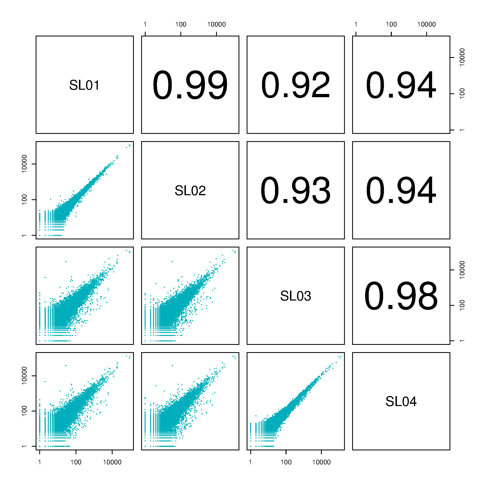
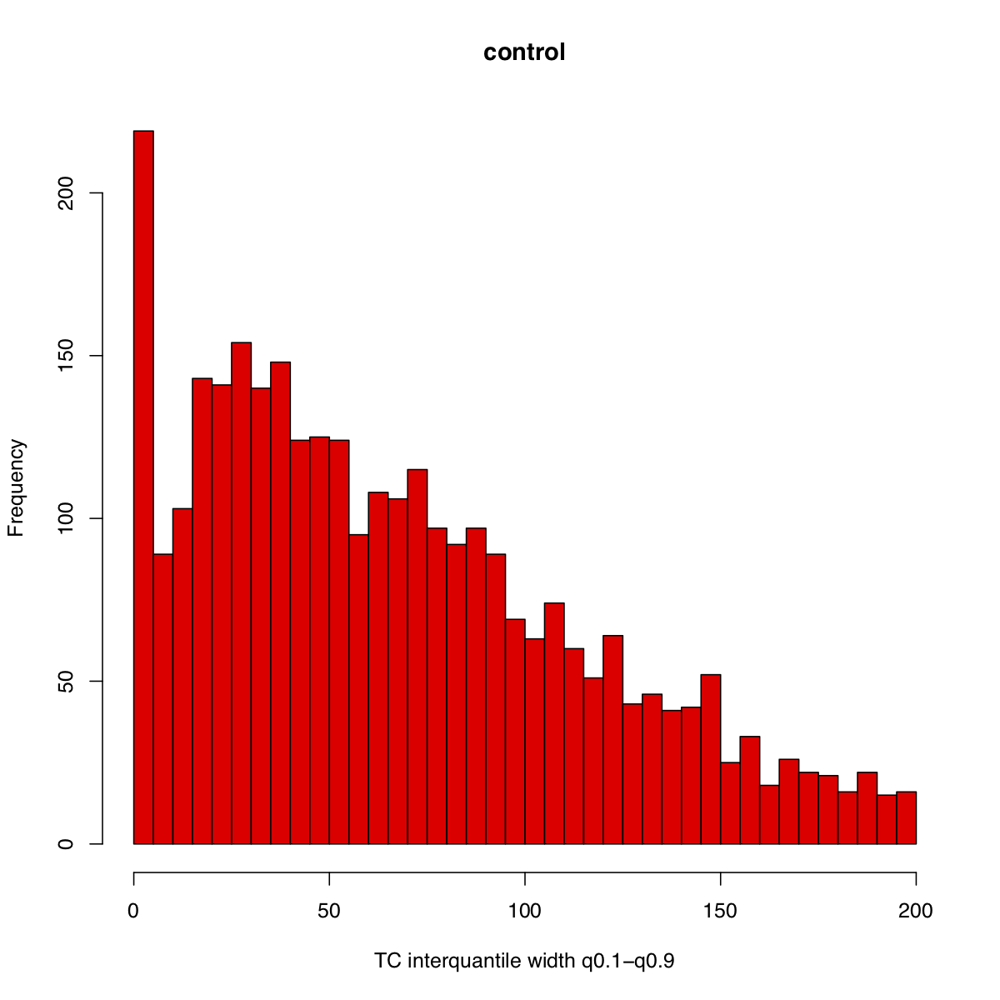
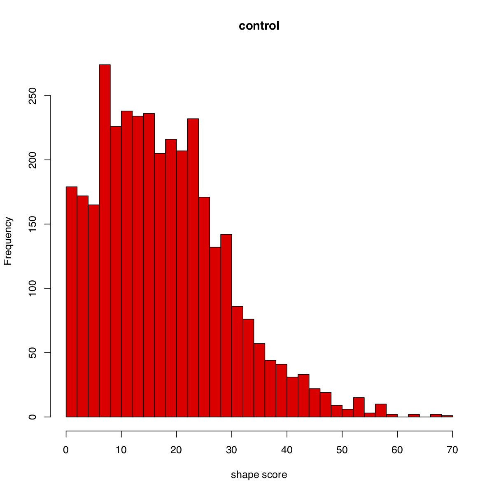
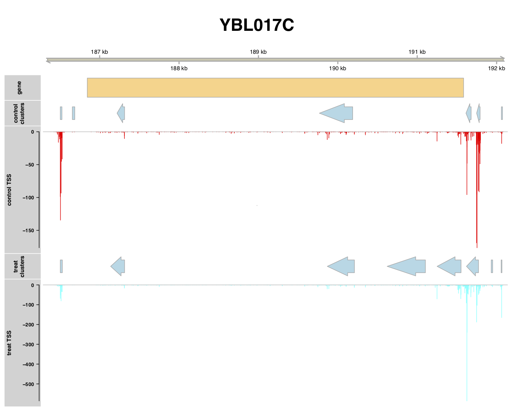

# TSSr: an R/Bioconductor package for transcription start sit (TSS) data analysis

Documentation is also available on GitHub Pages: https://github.com/Linlab-slu/TSSr

TSSr is designed to analyze transcription start sites (TSSs) and core promoters with most types of 5’end sequencing data, such as cap analysis of gene expression (CAGE) (Takahashi, Lassmann et al. 2012), no-amplification non-tagging CAGE libraries for Illumina next-generation sequencers (nAnT-iCAGE) (Murata, Nishiyori-Sueki et al. 2014), a Super-Low Input Carrier-CAGE (SLIC-CAGE) (Cvetesic, Leitch et al. 2018), NanoCAGE (Cumbie, Ivanchenko et al. 2015), TSS-seq (Malabat, Feuerbach et al. 2015), transcript isoform sequencing (TIF-seq) (Pelechano, Wei et al. 2013), transcript-leaders sequencing (TL-seq) (Arribere and Gilbert 2013), precision nuclear run-on sequencing (PRO-Cap) (Mahat, Kwak et al. 2016), and GRO-Cap/5’GRO-seq (Kruesi, Core et al. 2013).

TSSr package provides a comprehensive workflow on TSS data starts from identification of accurate TSS locations, clustering TSSs within small genomic regions corresponding to core promoters, and transcriptional activity quantifications, as well as specialized downstream analyses including core promoter shape, cluster annotation, gene differential expression, core promoter shift. TSSr can take multiple formats of files as input, such as Binary Sequence Alignment Mao (BAM) files (single-ended or paired-ended), Browser Extension Data (bed) files, BigWig files, ctss files or tss tables. TSSr also generates various types of TSS or core promoter track files which can be visualized in the UCSC Genome Browser or Integrative Genomics Viewer (IGV). TSSr also exports downstream analyses result tables and plots. Multiple cores are supported on Linux or Mac platforms.

# Pre-requisites:

* R version
  * Download R (>3.4.0) version from CRAN.
    * Windows: https://cran.r-project.org/bin/windows/base/
    * Mac OS X: https://cran.r-project.org/bin/macosx/
    * Linux: https://cran.r-project.org/bin/linux/

- Rsamtools package

  * install by using the following R commands:

        > if (!requireNamespace("BiocManager", quietly = TRUE))
        > install.packages("BiocManager")
        > BiocManager::install("Rsamtools")
  

- GenomicRanges

  * install by using the following R commands:

        > if (!requireNamespace("BiocManager", quietly = TRUE))
        > install.packages("BiocManager")
        > BiocManager::install("GenomicRanges")

- GenomicFeature package

  * install by using the following R commands:

        >if (!requireNamespace("BiocManager", quietly = TRUE))
        >install.packages("BiocManager")
        >BiocManager::install("GenomicFeatures")

- Gviz package

  * install by using the following R commands:

        > if (!requireNamespace("BiocManager", quietly = TRUE))
        > install.packages("BiocManager")
        > BiocManager::install("Gviz")  

- rtracklayer package

  * install by using the following R commands:

        > if (!requireNamespace("BiocManager", quietly = TRUE))
        > install.packages("BiocManager")
        > BiocManager::install("rtracklayer")

- DESeq2 package:

  * install by using the following R command:

        > if (!requireNamespace("BiocManager", quietly = TRUE))
        > install.packages("BiocManager")
        > BiocManager::install("DESeq2")

- BSgenome package

  * install by using the following R command:

        > if (!requireNamespace("BiocManager", quietly = TRUE))
        > install.packages("BiocManager")
        > BiocManager::install("BSgenome")

- data.table package

  * install by using the following R command:

        > install.packages("data.table")  

- stringr package:

  * install by using the following R command:

        > install.packages("stringr")

# Installing TSSr Package:

To install the TSSr package all the prerequisites above need to be installed.
After confirming those packages are installed, you can install the development version directly from GitHub using devtools:

        > devtools::install_github("Linlab-slu/TSSr")

# Usage:

* Launch TSSr

        > library(TSSr)
      
* Creating a TSSr object

        > myTSSr <- new("TSSr", genomeName = "BSgenome.Scerevisiae.UCSC.sacCer3"
	              ,inputFiles = inputFiles
	              ,inputFilesType= "bam"
	              ,sampleLabels = c("SL01","SL02","SL03","SL04")
	              ,sampleLabelsMerged = c("control","treat")
	              ,refSource = "saccharomyces_cerevisiae.SGD.gff"
	              ,organismName = "saccharomyces cerevisiae")

* Reading in the data and TSS processing

        > getTSS(myTSSr)
        > mergeSamples(myTSSr)
        > normalizeTSS(myTSSr)
        > filterTSS(myTSSr, method = "TPM",tpmLow=0.1)
        > plotCorrelation(myTSSr, samples = "all)
    

        > plotTssPCA(myTSSr, TSS.threshold=10)
    

        > exportTSStable(myTSSr, data = "raw", merged = "TRUE")
        > exportTSStoBedgraph(myTSSr, data = "processed", format = "bedGraph")
        > exportTSStoBedgraph(myTSSr, data = "processed", format = "BigWig")
        
* TSS clustering

        > clusterTSS(myTSSr, method = "peakclu",peakDistance=100,extensionDistance=30
	           ,localThreshold = 0.02,clusterThreshold = 1
	           ,useMultiCore=FALSE, numCores=NULL)
		> exportClustersTable(myTSSr, data = "filtered")
		> exportClustersToBed(myTSSr, data = "tagClusters")

* Aggregating consensus clusters

        > consensusCluster(myTSSr, dis = 50, useMultiCore = FALSE)
		> exportClustersToBed(myTSSr, data = "consensusClusters")

* Core promoter shape

        > shapeCluster(myTSSr,clusters = "consensusClusters", method = "PSS",useMultiCore= FALSE, numCores = NULL)
        > plotInterQuantile(myTSSr,samples = "all",tagsThreshold = 1)
    

        > plotShape(myTSSr)
    

		> exportShapeTable(myTSSr)

* Annotation

        > annotateCluster(myTSSr,clusters = "consensusClusters",filterCluster = TRUE,
	                filterClusterThreshold = 0.02, annotationType = "genes"
	                ,upstream=1000, upstreamOverlap = 500, downstream = 0)
		> exportDETable(myTSSr, data = "sig")
                  
* Differential expression analysis

        > deGene(myTSSr,comparePairs=list(c("control","treat")), pval = 0.01,useMultiCore=FALSE, numCores=NULL)
        > exportShiftTable(myTSSr)
        > plotDE(myTSSr, withGeneName = "TRUE",xlim=c(-2.5, 2.5),ylim=c(0,10))
    

* Core promoter shifts

        > shiftPromoter(myTSSr,comparePairs=list(c("control","treat")), pval = 0.01)
        > plotTSS(myTSSr,samples=c("control","treat"),tssData = "processed",clusters = "filtered",clusterThreshold = 0.02
	        ,genelist=c("YBL017C","YBL067C"),up.dis =500,down.dis = 100)
          

# Contact Author:

Zhaolian Lu

Affiliation: Lin Lab, Department of Biology, Saint Louis University, MO, USA.

Email: zhaolian.lu@slu.edu

# Reference:

Arribere, J. A. and W. V. Gilbert (2013). "Roles for transcript leaders in translation and mRNA decay revealed by transcript leader sequencing." Genome Res 23(6): 977-987.
Cumbie, J. S., M. G. Ivanchenko and M. Megraw (2015). "NanoCAGE-XL and CapFilter: an approach to genome wide identification of high confidence transcription start sites." BMC Genomics 16: 597.
Cvetesic, N., H. G. Leitch, M. Borkowska, F. Muller, P. Carninci, P. Hajkova and B. Lenhard (2018). "SLIC-CAGE: high-resolution transcription start site mapping using nanogram-levels of total RNA." Genome Res 28(12): 1943-1956.
Kruesi, W. S., L. J. Core, C. T. Waters, J. T. Lis and B. J. Meyer (2013). "Condensin controls recruitment of RNA polymerase II to achieve nematode X-chromosome dosage compensation." Elife 2: e00808.
Mahat, D. B., H. Kwak, G. T. Booth, I. H. Jonkers, C. G. Danko, R. K. Patel, C. T. Waters, K. Munson, L. J. Core and J. T. Lis (2016). "Base-pair-resolution genome-wide mapping of active RNA polymerases using precision nuclear run-on (PRO-seq)." Nat Protoc 11(8): 1455-1476.
Malabat, C., F. Feuerbach, L. Ma, C. Saveanu and A. Jacquier (2015). "Quality control of transcription start site selection by nonsense-mediated-mRNA decay." Elife 4.
Murata, M., H. Nishiyori-Sueki, M. Kojima-Ishiyama, P. Carninci, Y. Hayashizaki and M. Itoh (2014). "Detecting expressed genes using CAGE." Methods Mol Biol 1164: 67-85.
Pelechano, V., W. Wei and L. M. Steinmetz (2013). "Extensive transcriptional heterogeneity revealed by isoform profiling." Nature 497(7447): 127-131.
Takahashi, H., T. Lassmann, M. Murata and P. Carninci (2012). "5' end-centered expression profiling using cap-analysis gene expression and next-generation sequencing." Nat Protoc 7(3): 542-561.

